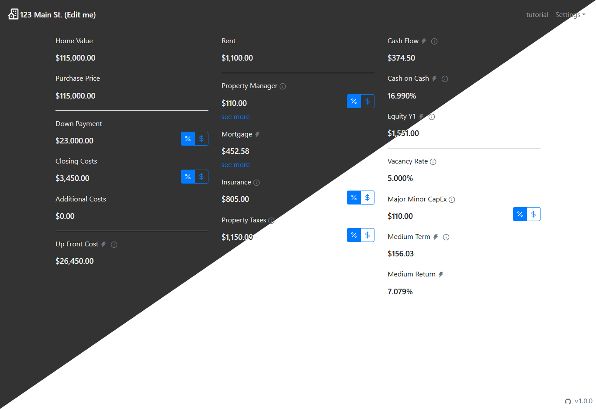

# [Reval](https://kmccullen97.github.io/reval/)

A rental property evaluator with sharable links.

# Features

- **Evaluate rental properties.** Evaluate rental properties in real time. Editing fields automatically re-calculates all other fields.
- **Sharable links.** Editing any field will update the url with a new value. This link can then be shared to others.
- **Dark mode.** Toggle between light and dark mode in the settings dropdown.
- **Value Compare.** Set value compare then update fields to compare. Found in the settings dropdown.

Checkout the [milestones](https://github.com/kmccullen97/reval/milestones) for future features.

# Contributing

Looking to get involved? Checkout out the contributing guide [here](/CONTRIBUTING.md).
